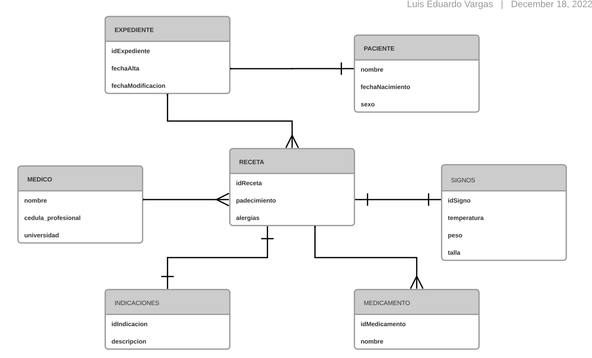

# Expediente Medico Personal
Este es el repositorio del proyecto del Talent Lab BEDU - HSBC.

En este encontraras el backend echo en Spring Java, mientras que el front(Angular) del proyecto lo podras ver en el siguiente repositorio:
https://github.com/Luyz13/expedienteFront

## Tablero Kanban

Se uso un tablero Kanban para llevar un control de las tareas, relacionadas a los entregables de los modulos.   Dicho tablero lo pueden consultar en:

https://github.com/users/Luyz13/projects/2/

## Descripción:

El propocito del proyecto es registrar la información de las recetas medicas recibidas, esto con la finalidad de tener a la mano los datos relacionados a la receta y asi tener un Expediente Digital.

## Entidades.

Realice un analisis preliminar, en el cual use algunas recetas como ejemplo para indentificar a los <i>Actores</i> principales y asi poder modelarlos como Entidades en un diagrama ER.  Dichas entidades identificadas son:

<ul>
 <li>Expediente</li>
 <li>Paciente</li>
 <li>Medico</li>
 <li>Receta</li>
 <li>Medicamento</li>
 <li>Signo</li>
 <li>Indicacion</li>
</ul>

De manera preliminar el diagrama que se obtuvo fue el siguiente:

Dichas entidades fueron modeladas dentro del paquete <i>Entity</i>, en donde se uso JPA

## BEANS

 La apliación que se construyo, sigue un arquitectura en capas.   Y en el presente proyecto se tienen 3 capas:

<ul>
 <li>Controller</li>
 <li>Service</li>
 <li>Repository</li>
</ul>

En el proyecto, cada entidad  tiene su clase Controller, Service, etc. Cada clase fue representada como un bean usando la notación correspondiente

## Monitoreo y Logs

 Para el proyecto se uso la librería Slf4j, y se configuro para que en cada capa y cada metodo, nos avise que esta pasando mientras la aplicación se ejecuta.

## Lombok

 Se indentifico y refactorizo el proyecto para simplificar el código

Las notaciones que se usaron fueron:

<ul>
 <li>@Getter</li>
 <li>@Setter</li>
 <li>@AllArgsConstructor</li>
 <li>@NoArgsConstructor</li>
</ul>

## Spring Data Validation

Se usaron algunas notaciones, con la finalidad de poder validar las clases Entity.   Las notaciones son:

<ul>
 <li>@NotEmpty</li>
 <li>@Size</li>
 <li>@NotBlank</li>
 <li>@NotNull</li>
</ul>

## Manejo de Errores.

 Se definieron 3 formas de manejar Errores:

<ul>
 <li>handleMethodArgumentNotValid:</li>
 
Nos sirve para regresar como respuesta un mensaje en caso de que no se cumplan con los criterios de Spring Validation

 <li>handleHttpRequestMethodNotSupported</li>
 
Nos sirve para regresar una respuesta en caso de que se quiera consumir un endpoint no definido en nuestros controladores

 <li>Exception</li>
 
 Para manjear errores generales

</ul>

## Security

 Inicialmente se definio una politica de accesso, en donde existen 2 roles Administradores y Usuario.

 <ul>
 <li>Admin</li>
  
Solo los usuarios que tengan este rol podran hacer cambios en BD, es decir crear, modificar y eliminar

 <li>User</li>
  
Solo podran leer información

  <li>Anonimo</li>
  
Este no es un rol pero se configuraron las politicas para que cualquier rol pudieran leer la información de todos y buscar uno para los endpoints de Medicos y Medicmanetos

</ul>

Esto es importante ya que bajo este criterio se le dio prioridad de lado del Frontend para abordar el modulo de Medicos

## Test Unitarios

Se aplicaron algunos test sobre la capa de Service, que es la que corresponde a la Logica del Negocio.   Algunas pruebas podian ser repetitivas por lo cual se tomo uno o dos metodos por cada Endpoint

 
## Despliegue:

Para el desbliegue se tienen 2 maneras diferentes, usando Docker:

<ol>
 <li>Docker Compose:</li>
  
docker-compose up

 <li>Docker como Provider en Terraform:</li>
  
terraform init

  
terraform plan

  
terraform apply

</ol>

## CI & CD

 Se uso jenkins, para que cada vez que hubiera un cambio se ejecutara un pipeline en donde se iba compilar el código, hacer una imagen docker y hacer un despligue con docker compose

Quedo pendiente aplicar pruebas al código con Sonar

  
  

